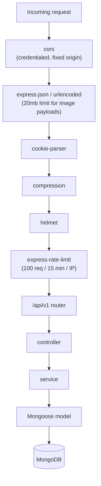
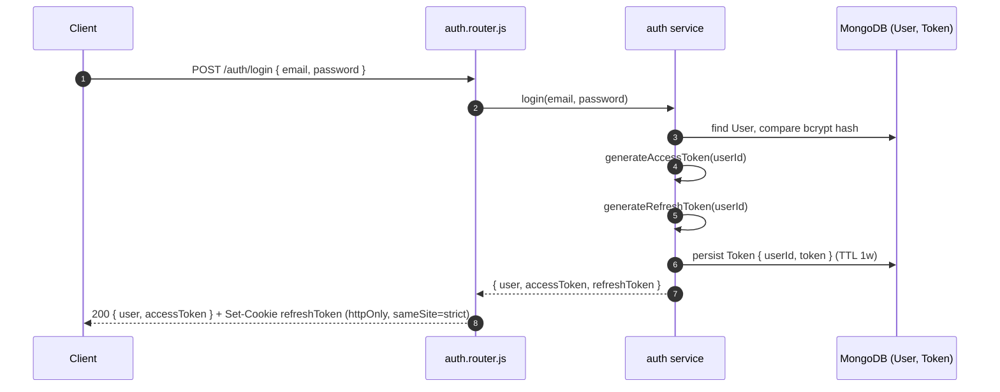
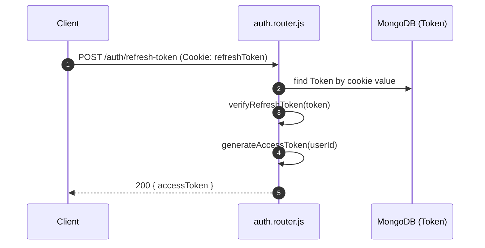
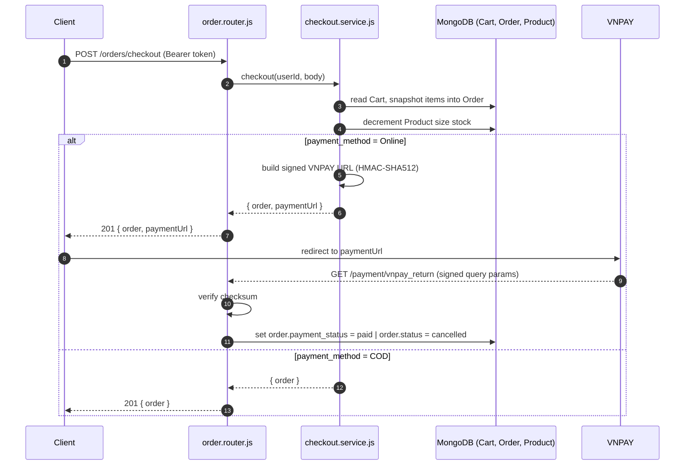
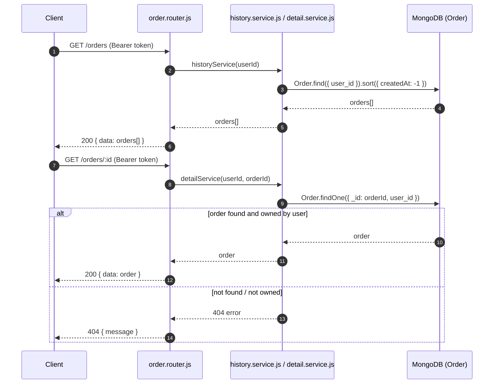
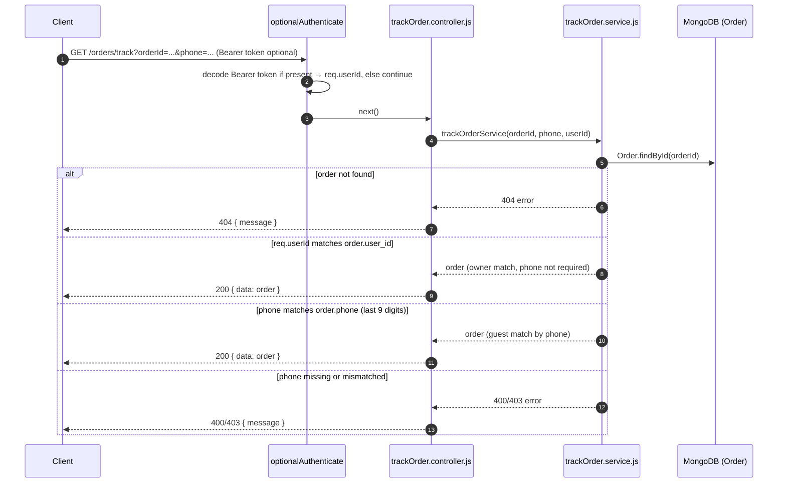

<h1 align="center">Crest Walk API</h1>

<p align="center">
  <strong>A modular Express 5 + MongoDB/Mongoose REST API powering a sneaker/shoe e-commerce platform, with JWT auth, Cloudinary image uploads, and VNPAY payments.</strong>
</p>
<p align="center">
  <em>This repository is the <strong>backend-only</strong> service of the Crest Walk platform. It exposes a public storefront API (products, cart, wishlist, checkout, order tracking, reviews) and an admin API (products, categories, brands, inventory, orders, users, vouchers, reviews, banners, revenue & bestseller stats), consumed by a separate <a href="#-related-frontend">React frontend</a> over JWT-authenticated HTTP.</em>
</p>

<p align="center">
  <a href="https://nodejs.org/"></a>
  <a href="https://expressjs.com/"></a>
  <a href="https://www.mongodb.com/"></a>
  <a href="https://mongoosejs.com/"></a>
  <a href="https://jwt.io/"></a>
  <a href="https://cloudinary.com/"></a>
  <a href="https://sandbox.vnpayment.vn/"></a>
  <a href="https://jestjs.io/"></a>
  <a href="LICENSE"></a>
</p>

## 📚 Table of Contents

- [Overview](#-overview) — key features
- [Tech & Architecture](#-tech--architecture) — stack, folder layout, routes, runtime flows
- [Getting Started](#-getting-started) — install, configure, run, lint, test
- [API Reference](#-api-reference) — auth, storefront & admin endpoints
- [Data Model](#-data-model) — schemas & entity relationships
- [Project Info](#-project-info) — related frontend, author, contact, license

---

## 🎯 Overview

### Key Features

- **Storefront API**
  - Public product catalog with listing, search, filtering, and detail lookup.
  - Cart and wishlist tied to the authenticated user, plus a guest-or-authenticated order-tracking endpoint.
  - Checkout that snapshots cart items into an order, decrements size-level stock, and (optionally) kicks off a VNPAY payment.
  - Product reviews with a purchase-eligibility check before a user is allowed to review.
- **Authentication & Session**
  - JWT **access token** (short-lived, returned in the response body) + JWT **refresh token** (long-lived, stored server-side and issued as an **httpOnly cookie**).
  - `POST /auth/refresh-token` mints a new access token from the refresh cookie; `POST /auth/logout` revokes it.
  - Password reset flow backed by a hashed, TTL-expiring `PasswordResetToken` and a pluggable email sender (`noop` / `console` / `resend`).
  - Role-based access control (`user` / `admin`) via `authenticate` + `authorize([...roles])` middleware.
- **Admin API**
  - Full CRUD for Products, Categories, Brands, Inventory, Orders, Users, Vouchers, Reviews (moderation), and Banners — all gated behind `authenticate` + `authorize(['admin'])`.
  - Revenue and bestseller analytics endpoints with date-range/interval query params.
  - A server-side remote-image fetch proxy (SSRF-guarded) so the admin UI can pull external images without CORS issues.
- **Media & Payments**
  - Multer (in-memory) + Cloudinary for product/banner image uploads, with 2MB/file limits and automatic overwrite of previously uploaded assets.
  - VNPAY integration for online payments: signed redirect URL at checkout, HMAC-SHA512-verified return/IPN callback.
- **Security & Ops**
  - `helmet`, `cors` (credentialed, single allowed origin), `express-rate-limit` (100 req / 15 min / IP), `compression`, request body limits raised for base64 image payloads.
  - `winston` structured logging, graceful shutdown on `SIGTERM`/`SIGINT` with MongoDB disconnect.

---

## 🛠️ Tech & Architecture

### Tech Stack & Key Libraries

- **Runtime & Framework**: Node.js (`>=18`), Express 5, ES Modules (`"type": "module"`)
- **Database & ODM**: MongoDB via Mongoose 9
- **Auth**: `jsonwebtoken` (access + refresh tokens), `bcrypt` (password hashing), `cookie-parser` (refresh-token cookie)
- **Validation**: `express-validator`
- **Media**: `multer` (memory storage), `cloudinary`
- **Payments**: VNPAY (HMAC-SHA512 signed URLs, sandbox gateway)
- **Security & Perf**: `helmet`, `cors`, `express-rate-limit`, `compression`
- **Logging**: `winston`
- **Testing**: Jest 30 (ESM via `--experimental-vm-modules`), `supertest` (installed, not yet wired to route tests)
- **Tooling**: Prettier (`npm run lint` is check-only), `nodemon` for dev reload, GitHub Actions CI (Node 18.x/20.x/22.x matrix)

### Project Structure

```text
crest-walk-api-JS/
├── src/
│   ├── server.js               # Entry point: middleware stack, DB connect, listen, graceful shutdown
│   ├── config/
│   │   └── env.config.js       # Reads/validates environment variables
│   ├── lib/                    # Cross-cutting infra: mongoose, jwt, cloudinary, rate_limit, winston, emailSender
│   ├── middleware/              # authenticate, authorize, optionalAuthenticate, uploadImage, validationError
│   ├── model/                   # Mongoose schemas (User, Product, Order, Cart, Category, Brand, Review, ...)
│   ├── router/
│   │   ├── index.router.js      # Mounts every route under /api/v1
│   │   ├── auth.router.js       # /auth/*
│   │   ├── admin/                # /admin/* — products, categories, brands, orders, users, inventory,
│   │   │                          # vouchers, reviews, banners, stats, fetch-remote-image
│   │   └── user/                  # /products, /cart, /orders, /wishlist, /payment, /reviews
│   ├── controller/               # Request/response handling, mirrors router/ resource-by-resource
│   ├── service/                   # Business logic layer, mirrors controller/ 1:1
│   ├── utils/                     # Small helpers (slug generation, username generation)
│   └── test/                       # Jest tests
├── nodemon.json             # Dev-mode watch config
├── package.json / package-lock.json
├── LICENSE
└── README.md
```

### Application Architecture

Architecture pattern: **router → controller → service → model**, applied consistently across every resource.

#### Request Lifecycle



#### Route Map

Base path: `/api/v1`.

| Mount           | Router file                       | Guard                                                   |
| :-------------- | :-------------------------------- | :------------------------------------------------------ |
| `/auth`         | `router/auth.router.js`           | per-route (see [Auth Endpoints](#-api-reference))       |
| `/admin/*`      | `router/admin/index.router.js`    | 🔒 `authenticate` + `authorize(['admin'])`              |
| `/products`     | `router/user/product.router.js`   | public                                                  |
| `/brands`       | `router/admin/brand.router.js`    | public                                                  |
| `/categories`   | `router/admin/category.router.js` | public                                                  |
| `/banners`      | `router/admin/banner.router.js`   | public                                                  |
| `/cart`         | `router/user/cart.router.js`      | 🔒 `authenticate`                                       |
| `/orders/track` | `trackOrder.controller.js`        | `optionalAuthenticate`                                  |
| `/orders`       | `router/user/order.router.js`     | 🔒 `authenticate`                                       |
| `/wishlist`     | `router/user/wishlist.router.js`  | 🔒 `authenticate`                                       |
| `/payment`      | `router/user/payment.router.js`   | public                                                  |
| `/reviews`      | `router/user/review.router.js`    | per-route (see [Storefront Endpoints](#-api-reference)) |

> ⚠️ **Known gap:** `/brands`, `/categories`, and `/banners` are wired directly to the same router files used under `/admin` (full CRUD, including `POST`/`PUT`/`DELETE`), but are mounted without `authenticate`/`authorize`. Only `GET` is intended to be public — treat write access on these three paths as unauthenticated until this is locked down.

<details>
<summary><b>🧩 Click to expand key runtime flows (Auth, Refresh, Orders, Tracking)</b></summary>

##### 1. Register / Login flow



##### 2. Access-token refresh



##### 3. Checkout with online payment



##### 4. Order history & detail



##### 5. Order tracking (guest or authenticated)



</details>

---

## 🚀 Getting Started

Requires Node.js `>= 18.x`, a MongoDB instance (local or [Atlas](https://www.mongodb.com/cloud/atlas)), and a Cloudinary account for image uploads.

1. **Clone the repository**

   ```bash
   git clone https://github.com/MT-KS-04/crest-walk-api.git
   cd crest-walk-api-JS
   ```

2. **Install dependencies**

   ```bash
   npm install
   ```

3. **Configure environment variables**

   Create a `.env` file in the project root:

   ```env
   # Server
   PORT=3000
   NODE_ENV=development
   LOG_LEVELS=info

   # Database
   MONGOOSE_URL=mongodb://localhost:27017/crest-walk-api

   # JWT
   JWT_ACCESS_SECRET=change-me-access-secret
   JWT_REFRESH_SECRET=change-me-refresh-secret
   ACCESS_TOKEN_EXPIRY=15m
   REFRESH_TOKEN_EXPIRY=7d

   # Cloudinary
   CLOUDINARY_CLOUD_NAME=your-cloud-name
   CLOUDINARY_API_KEY=your-api-key
   CLOUDINARY_API_SECRET=your-api-secret

   # Password reset email (optional — defaults to a no-op sender)
   EMAIL_PROVIDER=noop        # noop | console | resend
   EMAIL_FROM=no-reply@example.com
   EMAIL_API_KEY=
   FRONTEND_URL=http://localhost:3001
   PASSWORD_RESET_TOKEN_EXPIRY=15m
   PASSWORD_RESET_EXPOSE_TOKEN=false
   ```

   > `src/server.js` currently hardcodes the allowed CORS origin to `http://localhost:3001` and VNPAY credentials are hardcoded placeholders in `src/service/user/payment/vnpayUtils.js` — update both directly in code if your frontend origin or VNPAY merchant details differ.

4. **Run the server in development**

   ```bash
   npm run dev
   ```

   The API is available at `http://localhost:3000/api/v1/` and auto-reloads on file changes (`nodemon.json`).

5. **Run the server in production**

   ```bash
   npm start
   ```

6. **Lint**

   ```bash
   npm run lint    # prettier --check .
   ```

7. **Run tests**

   ```bash
   npm test        # Jest, ESM mode, coverage report in coverage/
   ```

---

## 📡 API Reference

### Health Check

The root endpoint returns a health check:

```json
{
  "message": "API is live",
  "status": "ok",
  "serviceName": "crest-walk-api",
  "version": "1.0.0",
  "environment": "development",
  "uptime": 12.345,
  "server": "Express + Node.js",
  "docs": "https://docs.crest-walk-api.mk-ts-04.com",
  "timestamp": "2026-07-16T16:12:00.000Z"
}
```

### Auth Endpoints

Base path: `/auth`.

| Method | Endpoint                | Access                  | Notes                                         |
| :----- | :---------------------- | :---------------------- | :-------------------------------------------- |
| `POST` | `/auth/register`        | Public                  | `{ email, password, ... }`                    |
| `POST` | `/auth/login`           | Public                  | Sets `refreshToken` httpOnly cookie           |
| `GET`  | `/auth/me`              | 🔒 `user` or `admin`    | Current user profile                          |
| `POST` | `/auth/refresh-token`   | Cookie (`refreshToken`) | Issues a new access token                     |
| `POST` | `/auth/logout`          | Cookie (`refreshToken`) | Revokes the refresh token, clears the cookie  |
| `POST` | `/auth/forgot-password` | Public                  | Starts password-reset flow (emails a token)   |
| `POST` | `/auth/reset-password`  | Public                  | Consumes the reset token, sets a new password |

### Storefront Endpoints

Public / authenticated-user routes.

| Method   | Endpoint                         | Access           | Notes                                          |
| :------- | :------------------------------- | :--------------- | :--------------------------------------------- |
| `GET`    | `/products`                      | Public           | List products                                  |
| `GET`    | `/products/search`               | Public           | Keyword search                                 |
| `GET`    | `/products/filter`               | Public           | Filter by category/brand/price/size, etc.      |
| `GET`    | `/products/:id`                  | Public           | Product detail                                 |
| `GET`    | `/cart`                          | 🔒 auth          | Current user's cart                            |
| `POST`   | `/cart/add`                      | 🔒 auth          | Add item                                       |
| `PUT`    | `/cart/update`                   | 🔒 auth          | Update quantity/size                           |
| `DELETE` | `/cart/remove`                   | 🔒 auth          | Remove item                                    |
| `POST`   | `/wishlist/add`                  | 🔒 auth          | Add product to wishlist                        |
| `GET`    | `/wishlist`                      | 🔒 auth          | List wishlist                                  |
| `DELETE` | `/wishlist/:productId`           | 🔒 auth          | Remove from wishlist                           |
| `POST`   | `/orders/checkout`               | 🔒 auth          | Builds order from cart; VNPAY URL if `Online`  |
| `GET`    | `/orders`                        | 🔒 auth          | Order history                                  |
| `GET`    | `/orders/:id`                    | 🔒 auth          | Order detail                                   |
| `GET`    | `/orders/track`                  | Guest or 🔒 auth | Order lookup (`optionalAuthenticate`)          |
| `POST`   | `/reviews`                       | 🔒 auth          | Submit a review (purchase-eligibility checked) |
| `GET`    | `/reviews/product/:productId`    | Public           | List a product's reviews                       |
| `GET`    | `/reviews/can-review/:productId` | 🔒 auth          | Check purchase/review eligibility              |
| `GET`    | `/payment/vnpay_return`          | Public           | VNPAY return/IPN callback                      |

### Admin Endpoints

Base path: `/admin/*`. Every route below requires `Authorization: Bearer <accessToken>` **and** `role: admin`.

#### Products

| Method   | Endpoint              | Notes                                       |
| :------- | :-------------------- | :------------------------------------------ |
| `GET`    | `/admin/products`     | List products                               |
| `POST`   | `/admin/products`     | Create; multipart field `images` (up to 10) |
| `GET`    | `/admin/products/:id` | Product detail                              |
| `PUT`    | `/admin/products/:id` | Update; `images` optional on re-upload      |
| `DELETE` | `/admin/products/:id` | Delete                                      |

#### Categories

| Method   | Endpoint                | Notes  |
| :------- | :---------------------- | :----- |
| `GET`    | `/admin/categories`     | List   |
| `POST`   | `/admin/categories`     | Create |
| `GET`    | `/admin/categories/:id` | Detail |
| `PUT`    | `/admin/categories/:id` | Update |
| `DELETE` | `/admin/categories/:id` | Delete |

#### Brands

| Method   | Endpoint            | Notes  |
| :------- | :------------------ | :----- |
| `GET`    | `/admin/brands`     | List   |
| `POST`   | `/admin/brands`     | Create |
| `GET`    | `/admin/brands/:id` | Detail |
| `PUT`    | `/admin/brands/:id` | Update |
| `DELETE` | `/admin/brands/:id` | Delete |

#### Orders

| Method | Endpoint                   | Notes                              |
| :----- | :------------------------- | :--------------------------------- |
| `GET`  | `/admin/orders`            | List all orders                    |
| `GET`  | `/admin/orders/:id`        | Order detail                       |
| `PUT`  | `/admin/orders/:id/status` | Update `status` / `payment_status` |

#### Users

| Method | Endpoint                          | Notes                          |
| :----- | :-------------------------------- | :----------------------------- |
| `GET`  | `/admin/users`                    | List users                     |
| `GET`  | `/admin/users/:id`                | User detail                    |
| `PUT`  | `/admin/users/:id/status`         | Update `status` / `role`       |
| `PUT`  | `/admin/users/:id/reset-password` | Admin resets a user's password |

#### Inventory

| Method  | Endpoint                                 | Notes                                      |
| :------ | :--------------------------------------- | :----------------------------------------- |
| `GET`   | `/admin/inventory`                       | List stock; `?lowStock=` filter            |
| `PATCH` | `/admin/inventory/:productId/size/:size` | Set/increment stock; `body.mode: set\|inc` |

#### Vouchers

| Method   | Endpoint              | Notes  |
| :------- | :-------------------- | :----- |
| `GET`    | `/admin/vouchers`     | List   |
| `POST`   | `/admin/vouchers`     | Create |
| `GET`    | `/admin/vouchers/:id` | Detail |
| `PUT`    | `/admin/vouchers/:id` | Update |
| `DELETE` | `/admin/vouchers/:id` | Delete |

#### Reviews (moderation)

| Method   | Endpoint                    | Notes                                         |
| :------- | :-------------------------- | :-------------------------------------------- |
| `GET`    | `/admin/reviews`            | List; filter by `status`/`productId`/`userId` |
| `GET`    | `/admin/reviews/:id`        | Detail                                        |
| `PUT`    | `/admin/reviews/:id/status` | Approve / reject                              |
| `DELETE` | `/admin/reviews/:id`        | Delete                                        |

#### Banners

| Method   | Endpoint             | Notes                                  |
| :------- | :------------------- | :------------------------------------- |
| `GET`    | `/admin/banners`     | List; filter by `position`/`is_active` |
| `POST`   | `/admin/banners`     | Create; multipart field `image_url`    |
| `GET`    | `/admin/banners/:id` | Detail                                 |
| `PUT`    | `/admin/banners/:id` | Update; `image_url` optional           |
| `DELETE` | `/admin/banners/:id` | Delete                                 |

#### Stats

| Method | Endpoint                   | Query params                                        |
| :----- | :------------------------- | :-------------------------------------------------- |
| `GET`  | `/admin/stats/revenue`     | `interval=day\|month\|year`, `startDate`, `endDate` |
| `GET`  | `/admin/stats/bestsellers` | `limit`, `startDate`, `endDate`                     |

#### Media

| Method | Endpoint                    | Notes                                                                           |
| :----- | :-------------------------- | :------------------------------------------------------------------------------ |
| `POST` | `/admin/fetch-remote-image` | SSRF-guarded proxy that fetches an external image by `{ url }` for the admin UI |

> All authenticated requests send `Authorization: Bearer <accessToken>`; the refresh-token cookie is only used by `/auth/refresh-token` and `/auth/logout`.

---

## 🗄️ Data Model

All 12 schemas live in `src/model/`. There is no separate "Shoe" model — footwear is represented by `Product`, with size/stock tracked per entry in its embedded `sizes` array.

### Entity Relationships

| Model      | Related Model        | Cardinality | Linked via                                |
| :--------- | :------------------- | :---------- | :---------------------------------------- |
| `User`     | `Cart`               | 1 : 1       | `Cart.user_id`                            |
| `User`     | `Order`              | 1 : N       | `Order.user_id`                           |
| `User`     | `Wishlist`           | 1 : N       | `Wishlist.user_id`                        |
| `User`     | `Review`             | 1 : N       | `Review.user_id`                          |
| `User`     | `Token`              | 1 : N       | `Token.userId` (refresh tokens)           |
| `User`     | `PasswordResetToken` | 1 : N       | `PasswordResetToken.userId`               |
| `Category` | `Product`            | 1 : N       | `Product.category_id`                     |
| `Brand`    | `Product`            | 1 : N       | `Product.brand_id`                        |
| `Product`  | `Review`             | 1 : N       | `Review.product_id`                       |
| `Product`  | `Wishlist`           | 1 : N       | `Wishlist.product_id`                     |
| `Voucher`  | `Order`              | 1 : N       | `Order.voucher_id` (optional)             |
| `Product`  | `Cart`               | N : N       | Embedded in `Cart.items[].product_id`     |
| `Product`  | `Order`              | N : N       | Snapshotted in `Order.items[].product_id` |

### Identity & Auth Models

#### User

| Field       | Type             | Notes                                    |
| :---------- | :--------------- | :--------------------------------------- |
| `username`  | `String`, unique | Max 20 chars                             |
| `password`  | `String`         | bcrypt-hashed in a `pre('save')` hook    |
| `full_name` | `String`         | Max 100 chars                            |
| `email`     | `String`, unique | Lowercased, regex-validated              |
| `phone`     | `String`         | Optional, 9-11 digits                    |
| `role`      | `String` enum    | `admin` \| `user` (default `user`)       |
| `status`    | `String` enum    | `active` \| `blocked` (default `active`) |

#### Token (refresh-token store)

| Field       | Type                | Notes                              |
| :---------- | :------------------ | :--------------------------------- |
| `token`     | `String`            | Raw refresh-token value            |
| `userId`    | `ObjectId` → `User` | Owner                              |
| `createdAt` | `Date`              | TTL index, auto-deletes after `1w` |

#### PasswordResetToken

| Field       | Type                | Notes                                        |
| :---------- | :------------------ | :------------------------------------------- |
| `userId`    | `ObjectId` → `User` | Indexed                                      |
| `tokenHash` | `String`            | SHA-256 hash of the raw reset token, indexed |
| `expiresAt` | `Date`              | TTL index, Mongo deletes at this exact date  |
| `usedAt`    | `Date`, nullable    | Set once the token is consumed               |

### Catalog Models

#### Product

| Field            | Type                                   | Notes                         |
| :--------------- | :------------------------------------- | :---------------------------- |
| `category_id`    | `ObjectId` → `Category`                | Required                      |
| `brand_id`       | `ObjectId` → `Brand`                   | Required                      |
| `name`           | `String`                               | Max 150 chars                 |
| `price`          | `Number`                               | ≥ 0                           |
| `original_price` | `Number`, nullable                     | Used to compute sale discount |
| `images`         | `[String]`                             | At least 1 required           |
| `description`    | `String`                               | Defaults to `''`              |
| `is_new`         | `Boolean`                              | Default `false`               |
| `is_sale`        | `Boolean`                              | Default `false`               |
| `rating`         | `Number`                               | 0-5, default 0                |
| `review_count`   | `Number`                               | Default 0                     |
| `sizes`          | `[{ size: Number, quantity: Number }]` | Embedded, per-size stock      |

#### Category

| Field  | Type             | Notes        |
| :----- | :--------------- | :----------- |
| `name` | `String`, unique | Max 50 chars |
| `slug` | `String`, unique | Lowercased   |

#### Brand

| Field         | Type               | Notes      |
| :------------ | :----------------- | :--------- |
| `name`        | `String`, unique   | -          |
| `slug`        | `String`, unique   | Lowercased |
| `logo`        | `String`, nullable | -          |
| `description` | `String`, nullable | -          |

#### Review

| Field        | Type                   | Notes                                 |
| :----------- | :--------------------- | :------------------------------------ |
| `user_id`    | `ObjectId` → `User`    | Required                              |
| `product_id` | `ObjectId` → `Product` | Required                              |
| `rating`     | `Number`               | 1-5                                   |
| `comment`    | `String`               | Max 1000 chars, defaults to `''`      |
| `status`     | `String` enum          | `pending` \| `approved` \| `rejected` |

### Commerce Models

#### Cart

| Field     | Type                                               | Notes                  |
| :-------- | :------------------------------------------------- | :--------------------- |
| `user_id` | `ObjectId` → `User`, unique                        | One cart per user      |
| `items`   | `[{ product_id, size: Number, quantity: Number }]` | Embedded, default `[]` |

#### Order

| Field            | Type                                                    | Notes                                                                |
| :--------------- | :------------------------------------------------------ | :------------------------------------------------------------------- |
| `user_id`        | `ObjectId` → `User`                                     | Required                                                             |
| `voucher_id`     | `ObjectId` → `Voucher`, nullable                        | Optional applied voucher                                             |
| `items`          | `[{ product_id, product_name, size, quantity, price }]` | Embedded snapshot at time of purchase, at least 1 item               |
| `total_price`    | `Number`                                                | ≥ 0                                                                  |
| `status`         | `String` enum                                           | `pending` \| `confirmed` \| `shipping` \| `delivered` \| `cancelled` |
| `payment_method` | `String` enum                                           | `COD` \| `Online`                                                    |
| `payment_status` | `String` enum                                           | `unpaid` \| `paid` (default `unpaid`)                                |
| `address`        | `String`                                                | Shipping address                                                     |
| `phone`          | `String`                                                | 9-11 digits                                                          |

#### Wishlist

| Field        | Type                   | Notes                                                    |
| :----------- | :--------------------- | :------------------------------------------------------- |
| `user_id`    | `ObjectId` → `User`    | Part of compound unique index                            |
| `product_id` | `ObjectId` → `Product` | Part of compound unique index (`user_id` + `product_id`) |

#### Voucher

| Field             | Type             | Notes                                  |
| :---------------- | :--------------- | :------------------------------------- |
| `code`            | `String`, unique | Uppercased                             |
| `description`     | `String`         | Defaults to `''`                       |
| `discount_type`   | `String` enum    | `percent` \| `fixed` (default `fixed`) |
| `discount_amount` | `Number`         | ≥ 0                                    |
| `min_order`       | `Number`         | Default 0                              |
| `max_uses`        | `Number`         | Default 0 (`0` = unlimited)            |
| `used_count`      | `Number`         | Default 0                              |
| `start_date`      | `Date`, nullable | -                                      |
| `end_date`        | `Date`, nullable | -                                      |
| `is_active`       | `Boolean`        | Default `true`                         |

### Content Models

#### Banner

| Field         | Type          | Notes                                           |
| :------------ | :------------ | :---------------------------------------------- |
| `title`       | `String`      | Required                                        |
| `image_url`   | `String`      | Required                                        |
| `link_url`    | `String`      | Defaults to `''`                                |
| `position`    | `String` enum | `hero` \| `sidebar` \| `popup` (default `hero`) |
| `order_index` | `Number`      | Display order, default 0                        |
| `is_active`   | `Boolean`     | Default `true`                                  |

---

## 📄 Project Info

### Related Frontend

The companion React storefront + admin dashboard lives in a separate repository and talks to this API via `VITE_API_URL` (must include `/api/v1`):

- **crest-walk-fe** — [github.com/MT-KS-04/crest-walk-fe](https://github.com/MT-KS-04/crest-walk-fe)

---

### Author & Contact

This project is conceptualized and implemented by **K'To Mis & His Team**. Feel free to reach out via the following channels 👇

- **K'To Mis**
  - 📧 Email: [ktomis10.work@gmail.com](mailto:ktomis10.work@gmail.com)
  - 🐙 GitHub: [@MT-KS-04](https://github.com/MT-KS-04)
- **His Team**
  - 🐙 GitHub: [@duytran1652004](https://github.com/duytran1652004)
  - 🐙 GitHub: [@diikann-r](https://github.com/diikann-r)
  - 🐙 GitHub: [@VanNghia2112](https://github.com/VanNghia2112)
  - 🐙 GitHub: [@duyhieu304](https://github.com/duyhieu304)

---

### License

This project is distributed under the **Apache License 2.0**. See the [`LICENSE`](LICENSE) file for full terms, rights, and limitations.

---

<p align="center">
  <b>© 2026 K'To Mis & His Team. All rights reserved.</b><br/>
  <em>Crest Walk API — an Express + MongoDB backend for a shoe e-commerce platform.</em>
</p>
